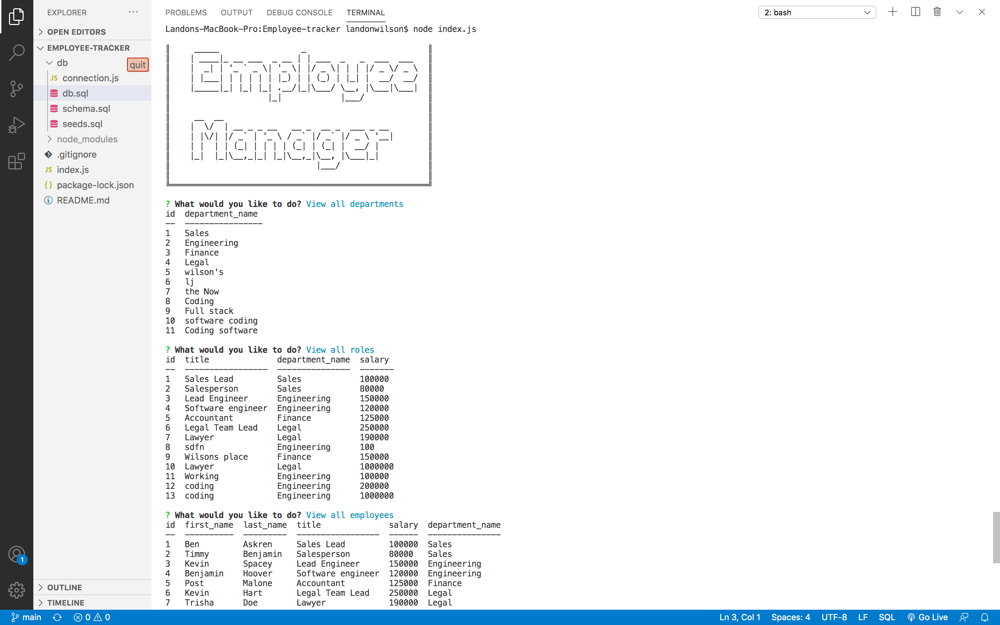

# Employee Tracker

  

  ## Desciption 
  Employee Tracker is a command-line application. The application uses SQL and Inquirer to help companies build an employee database. This application will allow a manager to view or create departments, roles, employees.
  
  Walkthrough video is listed below. 

[Walkthrough video](https://drive.google.com/file/d/1XmzIOpog3cIfv93owMaqfj0eeEY74iCE/view?usp=sharing)

  ## Table of Contents
  - [Installation](#installation)
  - [Usage](#usage)
  - [Questions](#questions) 

  ## Installation 
  To run the application run an npm install. After installing dependencies, run node index.js in your terminal to start the prompts that will guide you through the application.

  ## Usage 
  node index.js
  

  ## Questions 
  If you have any questions reach out to me at:  
  Github: https://github.com/Landonwilson1  
  Email: Landonjwilson1@gmail.com
